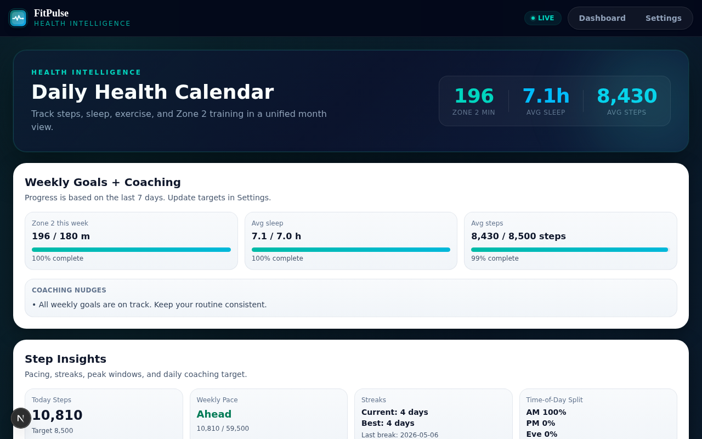
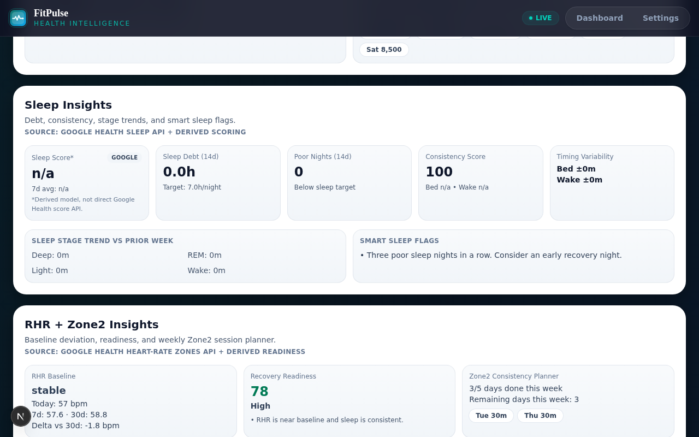
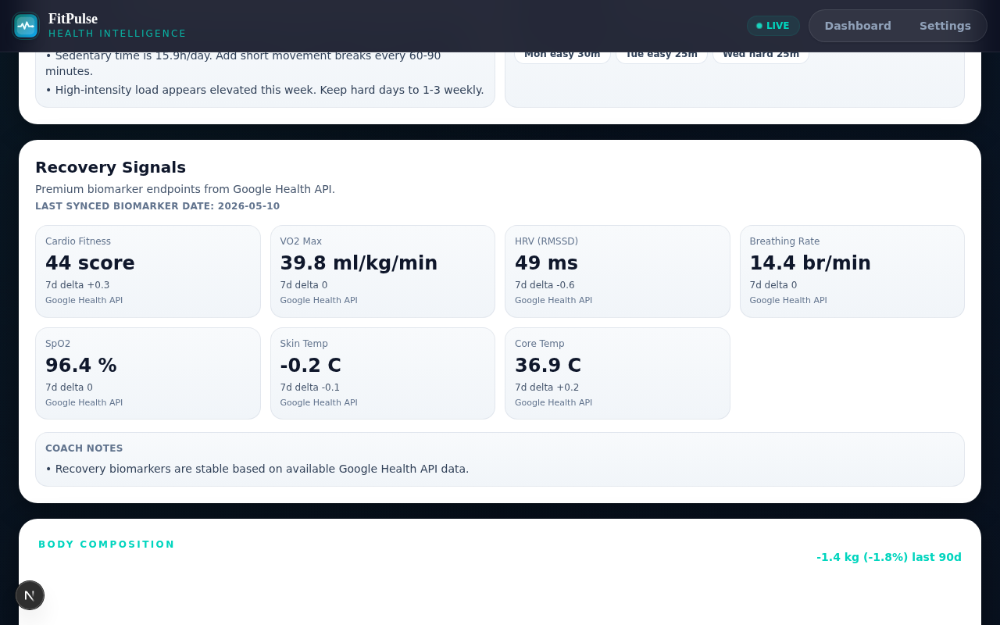
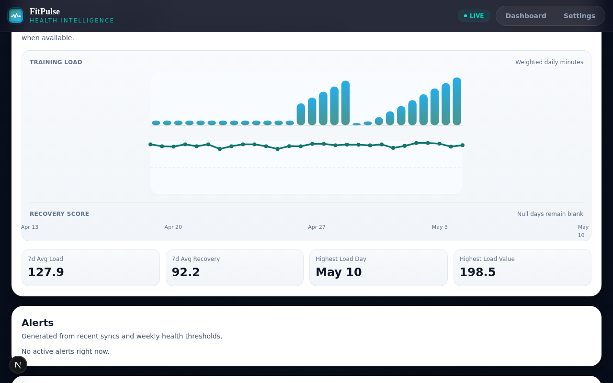
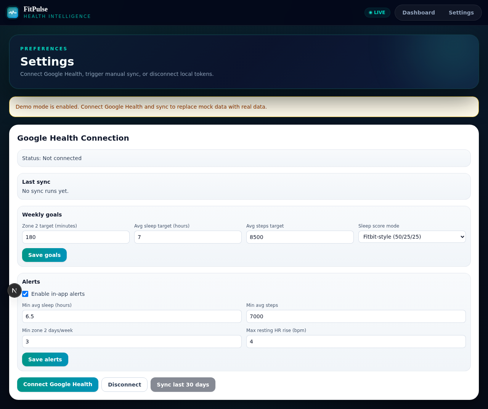

# fitPulse

[](https://github.com/anup4khandelwal/fitPulse/actions/workflows/ci.yml)
[](CONTRIBUTING.md)
[](LICENSE)

A modern, open-source health intelligence dashboard powered by the **Google Health API v4** — focused on real fitness outcomes: conditioning, recovery, sleep, heart-zone training, body composition, and trend-based coaching.

If you are building better health from data, this repo is for you.

If this project is useful, please **star the repo** to help more people discover it.

## Screenshots



> *Daily stats — Zone 2 minutes, avg sleep, avg steps — at a glance*



> *Sleep score, debt, consistency, stage breakdown, and smart flags*



> *VO2 Max, HRV, SpO2, breathing rate, skin temp — all from Google Health*



> *90-day weight trend, body fat %, and BMI with sparkline chart*



> *Connect Google Health, set weekly goals, configure alert thresholds*

## Why fitPulse

Most dashboards stop at vanity metrics. fitPulse is designed for:

- Daily readiness and recovery context
- Zone 2 consistency and intensity balance (80/20)
- Sleep quality and trends
- Weekly coaching signals from real health data
- A clean, modern UX for daily use

## Core Features

- OAuth Google Health integration (Google Health API v4)
- Premium dark UI — deep navy shell, glassmorphic hero cards, Apple Fitness-style design
- Calendar-based health dashboard with month navigation
- Sleep insights + derived sleep score breakdown (debt, consistency, stage trends)
- Step insights + pacing + streaks
- RHR + Zone 2 planning and readiness scoring
- Conditioning insights (active/sedentary balance, 80/20 intensity split)
- Recovery signals (VO2 Max, HRV, SpO2, breathing rate, skin temperature)
- **Weight & body composition** tracking (weight, body fat %, BMI — 90-day sparkline)
- Alerts engine + configurable thresholds
- Real-time webhook endpoint for Google Health data-change notifications
- Auto-sync endpoint for cron workflows

## Tech Stack

- Next.js 16 (App Router)
- TypeScript
- Prisma + SQLite
- Google Health API v4

## Quick Start

```bash
npm install
cp .env.example .env   # create this file manually if not present
npx prisma migrate dev
npx prisma generate
npm run dev
```

Open: `http://localhost:3000`

## Testing

```bash
npm run test:unit
npm run test:e2e
```

Install Playwright browser locally (first time):

```bash
npx playwright install chromium
```

Playwright MCP is installed. Run:

```bash
npm run mcp:playwright
```

MCP config is also included at `.mcp.json`.

## Ralph + Codex Integration

Automated task-loop scaffold is included:

- Workflow: `.github/workflows/ralph-codex.yml`
- Docs: `docs/ralph-codex.md`
- Local wrappers: `scripts/agent/run-ralph.sh`, `scripts/agent/run-codex.sh`
- Prompt templates: `scripts/agent/prompts/ralph-plan.txt`, `scripts/agent/prompts/codex-implement.txt`

Set `USE_RALPH_PLAN_CONTEXT=false` if you do not want to inject the Ralph plan into Codex execution prompts.

## Environment Variables

Never commit real secrets. Use your own values locally:

```env
DATABASE_URL="file:./dev.db"
GOOGLE_CLIENT_ID="your_google_client_id"
GOOGLE_CLIENT_SECRET="your_google_client_secret"
GOOGLE_REDIRECT_URI="http://localhost:3000/api/auth/fitbit/callback"
DEMO_MODE="false"
SYNC_CRON_SECRET="replace_with_long_random_secret"
AUTO_SYNC_DAYS="3"
```

## Google Health API Setup

1. Go to [Google Cloud Console](https://console.cloud.google.com) and create a project
2. Enable the **Google Health API**
3. Create OAuth credentials (Web application) with the redirect URI above
4. On the OAuth consent screen, add these scopes:
   - `googlehealth.activity_and_fitness.readonly`
   - `googlehealth.sleep.readonly`
   - `googlehealth.health_metrics_and_measurements.readonly`
   - `googlehealth.profile.readonly`
5. Add your Google account as a test user while in External/testing mode

## Google Health API Coverage

fitPulse uses the Google Health API v4 for:

- Steps (aggregated from interval data points)
- Active zone minutes (fat burn / cardio / peak)
- Sedentary periods
- Total calories
- Sleep sessions + stages (deep, light, REM, awake)
- Daily resting heart rate
- Daily heart rate zones
- Daily VO2 max
- Daily HRV (average RMSSD)
- Daily respiratory rate
- Daily oxygen saturation (SpO2)
- Daily sleep temperature derivations
- Exercise sessions (activity log)

Some metrics are intentionally labeled **Derived** where the API does not provide a direct score endpoint.

## Roadmap

- Training load vs recovery chart
- Overtraining risk flag
- Strength and mobility tracking module
- Coach summary (weekly AI narrative)
- Mobile-first companion layout

## Contributing

Contributions are welcome.

1. Fork the repo
2. Create a feature branch
3. Make focused changes with clear commit messages
4. Open a PR with screenshots and test notes

Please keep PRs small and production-minded.

Contributor guide: [`CONTRIBUTING.md`](CONTRIBUTING.md)

## Support the Project

If fitPulse helps you, please:

- Star this repo
- Share it with friends building fitness dashboards
- Open issues for bugs/feature requests
- Contribute improvements

## Security

- Do not commit `.env` files or production tokens
- Revoke and rotate tokens if leaked
- Use separate Google Cloud projects for local and production where possible

## License

MIT
